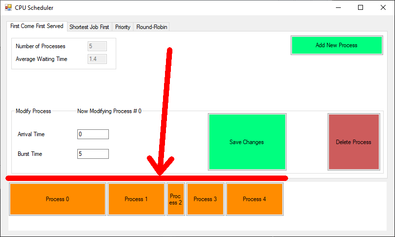

# CPU_Scheduling_Techniques
## What is this?
- This is a university project for 3rd year Computer and Systems Engineering Students in Ain Shams University.
- This project is a part of CSE322 Operating Systems course.
- This project shows different scheduling techniques used by Operating Systems.
## How to use it?
### Running it:
1. Download the .exe file in /bin/Debug directory
2. Run the .exe file
3. Download any required dependancies if an error has occured (you probably need to have .NET Framework installed for this to work)
### Using it:
- Use the "Add New Process" button to add a new process to the queue

- Click on a process to start modifying it

- The process being modified is shown here

- Change the parameters of the selected process as intended

- Click on "Save Changes" to save the modified parameters

- Any change is reflected immediately on the GanttChart

- Change the tab to switch to a different Scheduling Technique

- The total number of processes and average waiting time are calculated and shown on the top left

